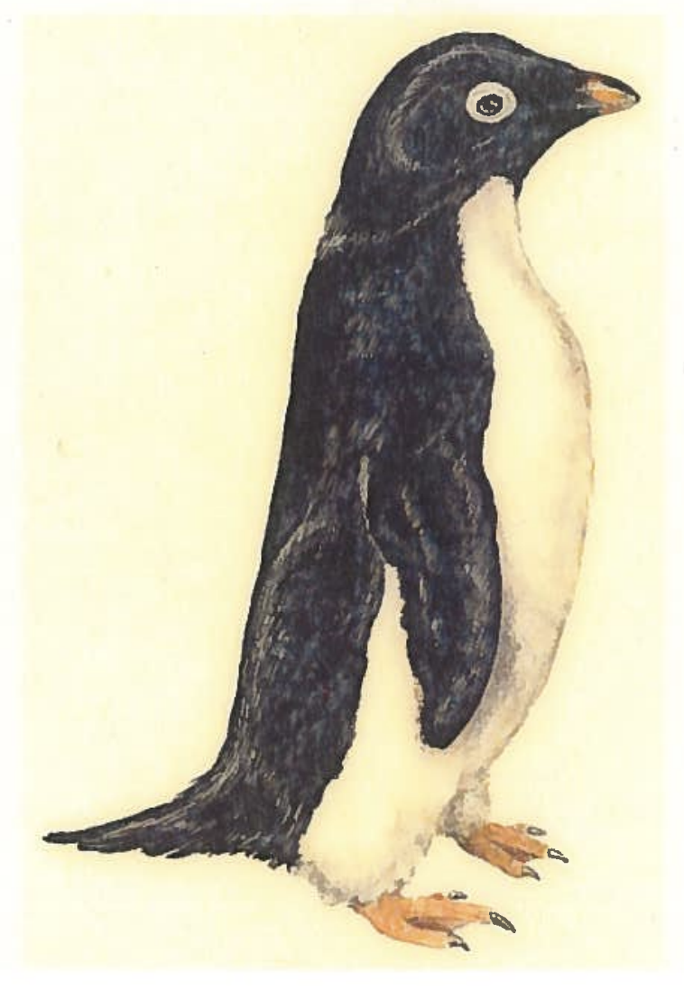

# Language-and-Cognitive-Research

## Overview
This project, supervised by Dr. Catherine Sandhofer and led by graduate student Erjing Zhang, focuses on the cognitive aspects of language acquisition in children. Utilizing text mining and visualization tools, we explore how young children use adjectives to describe various referents in picture-reading activities.

## Team Members
- Dr. Catherine Sandhofer (Supervisor)
- Erjing Zhang
- Qilin Zhou
- Shalmalee Joshi

## Data Source
We analyzed 33 counterbalanced transcripts from the CHILDES database, specifically from Gelman's 2014 individual differences corpus. The transcripts are based on picture-reading activities involving one-referent pictures, conducted between children and their parents. 

Participants included children, aged between 3 years and 9 months to 4 years and 11 months (average age 4 years and 4 months), along with their parents, totaling 72 child-parent pairs. Each pair participated in recordings of their interactions, as well as interactions between each individual and a researcher, during two laboratory visits spaced three to four weeks apart. Consequently, each pair contributed to six distinct interaction scenarios: Child-Parent for the first visit (C-P1), Child-Parent for the second visit (C-P2), Child-Researcher for the first visit (C-R1), Child-Researcher for the second visit (C-R2), Parent-Researcher for the first visit (P-R1), and Parent-Researcher for the second visit (P-R2). During these interactions, participants engaged with a 15-page picture book without text, which featured an equal distribution of images depicting animals, foods, and humans.

We only show C-R transcripts here for 33 children, but there are more in our Google Drive database.
- [Project Description for 2014 - Individual Differences Project](https://childes.talkbank.org/access/Eng-NA/Gelman.html)

   
  <em>Social Referent-King</em>

   
  <em>Animal Referent-Penguin</em>

   
  <em>Food Referent-Ice Cream</em>

  

## Text Mining Methodology
**1) spaCy Parsing to get referent-adj dictionary**
- **spaCy**: For text mining, specifically focusing on the use of adjectives for each referent in the pictures, including n-grams analysis for adjectives and nouns. In SpaCy, a Transformer (TRF) model leverages a neural network architecture that has been pre-trained on a large corpus of text using self-attention mechanisms. Hence, we use spacy.load("en_core_web_trf").
- **New Data Engineering Function Added**: **jaro_winkler_similarity** from **jellyfish** library. In instances where spaCy's parsing yields inaccurately identified adjectives or adjectives that are very similar but potentially erroneous (for example, "areplain" and "plain" identified for the referent "muffin", or "fastest" and "faster" for "weightlifter"), a direct approach to lemmatization can be applied. While effective, this method may overly simplify the adjective to its most basic form, sometimes leading to a loss of nuanced meaning. To address this issue, we adopt a strategy of retaining only the shorter form among similar adjectives. This means, for instance, we would record "fastest" simply as "faster" when both variations are encountered, aiming to maintain lexical simplicity while preserving the essence of the original description.

**2) N-distance analysis for adj-noun pairs**
- **bigram within a specified distance**: Although we have parsed adjectives here for each referent, the adjectives do not necessarily relate to the referent directly. Hence, we add this supplementary N-distance analysis to see more directly-related adj-noun pairs.

For example, in the instance where the child describes the surfer, one phrase used is "and um when it's really hot in the summer." Here, "hot" serves as an adjective that the child uses to characterize the ideal weather for surfing, rather than directly describing the surfer.

**3) PCA TF-IDF Analysis**
- **TF-IDF (Term Frequency-Inverse Document Frequency)**: This metric quantifies the relevance of a term within an individual document in comparison to a collection of documents. In our analysis, a "document" refers to all utterances grouped by a child's participant ID within a specific category (social, food, animals) from a comprehensive compilation of children's speech. Therefore, TF-IDF measures the significance of an adjective in a child's description relative to the adjective usage across all children, highlighting unique or distinctive adjective usage by individual children.
  
- **PCA (Principal Component Analysis) with 2 Components**:  By applying PCA to the TF-IDF matrix and reducing it to two components, we simplify the complex data while retaining significant patterns. In this visualization, proximity between points indicates that children have similar adjective usage profiles in the TF-IDF space. This suggests that these children might exhibit common patterns in their descriptions of a certain type of referent, indicating shared strategies or similarities in how they perceive and articulate characteristics of social entities, foods, and animals. We have also add K-Means Clustering as an optional plotting feature.
  
**4) Network Visualization**
- **Pyvis**: To visualize the network associations between adjectives and different types of referents (i.e., social, food, animals).

## Sample Visualization

  <b>Adjective Frequency For Weightlifter by spaCy</b>
   

  <b>Top_10 Adjectives For Social Referents</b>
   

  <b>Top_10 Bigrams For Social Referents</b>
   

  <b>Cat as a Neuron</b>
   

  <b>PCA TF-IDF For Social Referents</b>
   

  
[View Pair-wise Association](https://htmlpreview.github.io/?https://github.com/QilinZhou56/Language-and-Cognitive-Research/blob/main/referential_communication/Result/food_adj_referent.html)

If not worked properly, you could reference [HTML](https://github.com/QilinZhou56/Language-and-Cognitive-Research/blob/main/referential_communication/Result/food_adj_referent.html)

## Findings
Our findings reveal interesting patterns in the use of adjectives by four-year-old children:
- For food referents, children commonly used color, size, and taste adjectives, while **quality or functional adjectives were less frequent**.
- In describing human referents, children focused more on perceptual features and **less on inherent qualities like "alive", "good", or "kind"**.
- There was a larger variety of adjectives used for food referents compared to human referents, indicating a **protracted process in adjective usage** relative to noun acquisition.

## Cross-Validation
1. We extended our research by conducting cross-validation with other linguistic transcripts. This further established spaCy transformers as a robust tool for identifying parts of speech and analyzing language patterns in young children, with consistent 90% **baseline** accuracy. 
2. We will **continue improving** this model with modification regarding dependency and classification threshold, and training methods of existing files.

## Conclusion
Our project contributes to understanding how children's language and cognitive abilities develop, particularly in the context of adjective usage in descriptive tasks. These insights can be crucial for further research in developmental psychology and linguistics.

## Acknowledgments and Confidentiality
We would like to thank all contributors and participants involved in this research project. The two sample data, if used, should inform us for research confidentiality purposes.
